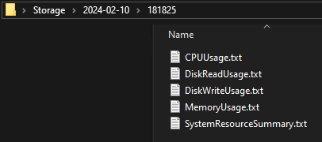

# Historical SysMonitor

## Introduction

This repository contains a set of tools designed to monitor and log system resource usage on Windows machines. It leverages a combination of Python and PowerShell to track CPU, memory, disk read/write activities, and system processes, organizing the data into time-stamped directories for historical analysis.

## Requirements and Dependencies

- **Operating System:** Windows
- **Python Version:** 3.6 or higher
- **Dependencies:**
  - PyQt5: For the GUI components of the system tray application.
  - psutil: For accessing system details and process information.
- **PowerShell:** Version 5.1 or higher for executing the script with necessary permissions.

## Setup Instructions

1. **Clone the Repository:**
   - Use Git or download the ZIP to get the repository files on your local machine.

2. **Install Python Dependencies:**
   - Run `pip install PyQt5 psutil` to install the required Python packages.

3. **Ensure PowerShell Execution Policy:**
   - Run `Set-ExecutionPolicy RemoteSigned` in PowerShell as an Administrator to allow script execution.

## Usage Guide

- **Starting the Monitor:**
  - Run the `historical_sysmonitor.py` script with Python to start the system monitoring. This will place an icon in your system tray.
  - Right-click the system tray icon and select "Settings" to configure the monitoring parameters.

- **Using PowerShell Script:**
  - The `getdata.ps1` script is automatically called by the Python script based on the configured intervals and thresholds.
  - It generates logs in the specified base directory, organizing them by date and time.

## Configuration Options

- **Python GUI:**
  - **Interval:** Define how often to check system resources (in hours, minutes, and seconds).
  - **Target Directory:** Choose where to save the log files.
  - **Log Usage Checbox:** Enable/Disable to log only when resource usage exceeds a value.
  - **Usage Threshold:** Set a percentage threshold to log only when resource usage exceeds this value.

- **PowerShell Script:**
  - **Base Directory (-baseDir):** Path to save the log files, passed by the Python script.
  - **Usage Threshold (-usageThreshold):** The minimum percentage of resource usage to trigger logging, also passed by the Python script.

## Download and Run

- Download the latest [historical_sysmonitor.exe](https://github.com/anandphulwani/Historical-SysMonitor/releases/latest/download/historical_sysmonitor.exe) executable from the release section, and you are ready to use.

## Screenshots

Below are screenshots showcasing the application in action:

- **Tray Icon:**
  - 

- **Settings Dialog:**
  - 

- **List Of Files:**
  - 

- **CPU Usage: (`Memory Usage`, `Disk Read Usage` and `Disk Write Usage` are similar)**
  - 

- **System Resource Summary:**
  - 

## Contributions and Issues

Feel free to contribute to the repository by submitting pull requests. If you encounter any issues or have suggestions for improvements, please open an issue in the repository or contact the maintainer directly.
